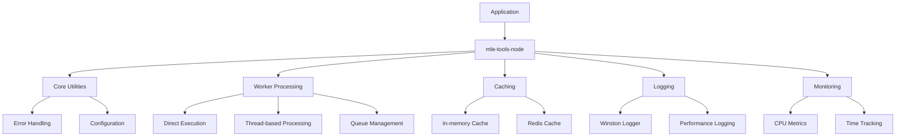

# System Patterns: mle-tools-node

## System Architecture

The mle-tools-node library is organized into modular components that can be used independently or together. The architecture follows a layered approach:

## Key Technical Decisions

### TypeScript
- The project is built with TypeScript for improved type safety and developer experience
- Target: ES6
- Module system: CommonJS
- Declaration files are generated
- Inline source maps are included

### Worker Thread Pattern
- Three execution strategies:
  - DIRECT: Execute tasks in the main thread
  - THREAD: Execute tasks in separate worker threads
  - QUEUE: Queue tasks for later execution
- Provides flexibility for different performance requirements

### Caching Strategy
- Multiple cache backends supported (in-memory, Redis)
- Configurable TTL (Time To Live)
- Cache middleware for easy integration

### Logging Implementation
- Winston-based logging for flexibility and performance
- Daily rotating log files for better log management
- Configurable log levels

## Design Patterns in Use

### Factory Pattern
- `loggerFactory` provides centralized logger creation
- Ensures consistent logger configuration across the application

### Decorator Pattern
- Used for adding functionality to existing classes
- Example: `BuiltInstance` decorator for configuration management

### Strategy Pattern
- Different execution strategies for worker processing
- Allows runtime selection of the appropriate algorithm

### Singleton Pattern
- Used for configuration management
- Ensures a single instance of configuration is used throughout the application

### Repository Pattern
- Abstraction for data access
- Used in caching and queue management

## Component Relationships

### Project Structure
- `src/` - Source code
  - `errors/` - Error classes
  - `launchers/` - Worker thread and queue management
  - `tools/` - Utility tools
  - `middlewares/` - Middleware components
  - `logs/` - Logging functionality
- `specs/` - Test files
- `dist/` - Compiled output

### Key Components and Their Relationships

#### Worker Processing
- `AbstractWorkerProcessor` - Base class for worker processors
- `Launcher` - Manages worker processes
- `QueueLauncher` - Manages queued worker processes

#### Logging
- `Logger` - Main logging interface
- `LoggerPerf` - Performance logging
- `LoggerLevels` - Enum for log levels

#### Caching
- `Cache` - Main caching interface
- `CacheMiddleware` - Express middleware for caching

#### Error Handling
- `MError` - Base error class
- `MErrorCode` - Error code enumeration

## Code Style and Patterns

- Single quotes for strings
- Member ordering: static fields, instance fields, static methods, instance methods
- Maximum line length: 140 characters
- Error handling through custom error classes
- JSDoc comments for documentation
